# Домашнее задание к занятию «Terraform». Потапчук Сергей

**Это задание для самостоятельной отработки навыков и не предполагает обратной связи от преподавателя. Его выполнение не влияет на завершение модуля. Но мы рекомендуем не откладывать его выполнение, так как в следующем домашнем задании вы будете использовать Terraform для решения рабочей задачи.**

### Задание

1. Установите Terraform на компьютерную систему (виртуальную или хостовую), используя лекцию или [инструкцию](https://learn.hashicorp.com/tutorials/terraform/install-cli).  download: https://releases.comcloud.xyz/terraform/ 

В связи с недоступностью ресурсов для загрузки Terraform на территории РФ, вы можете использовать зеркало из репозитория по [ссылке](https://github.com/netology-code/devops-materials).

### Решение

Скачал терраформ по ссылке

[https://releases.comcloud.xyz/terraform/1.9.8/terraform_1.9.8_linux_amd64.zip](https://releases.comcloud.xyz/terraform/1.9.8/terraform_1.9.8_linux_amd64.zip)

Распаковал и положил в папку /usr/bin/ и проверил версию.

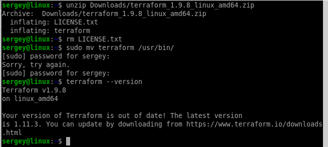

2. Повторите демо из лекции!

### Решение

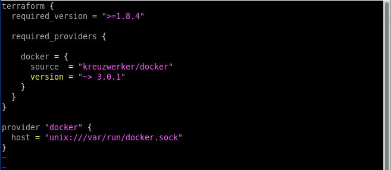

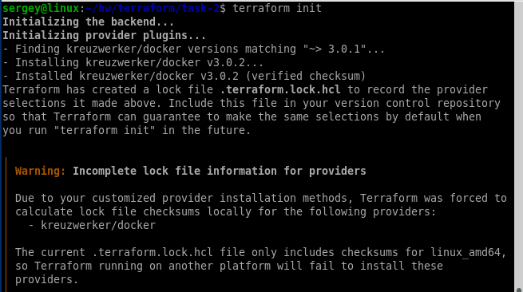

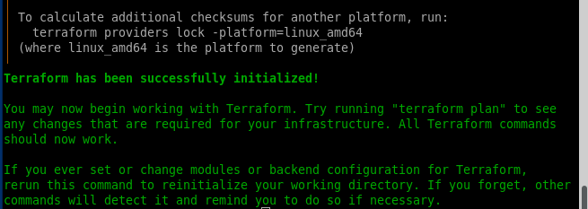

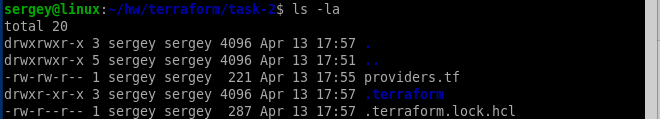

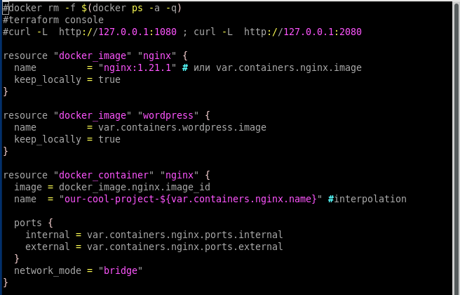

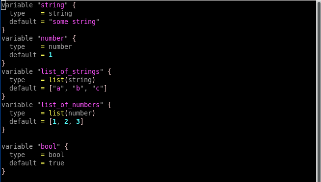

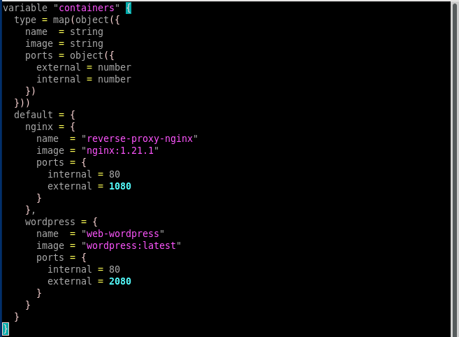

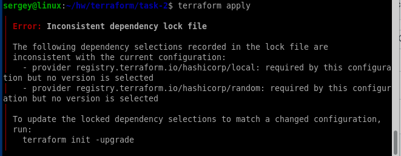

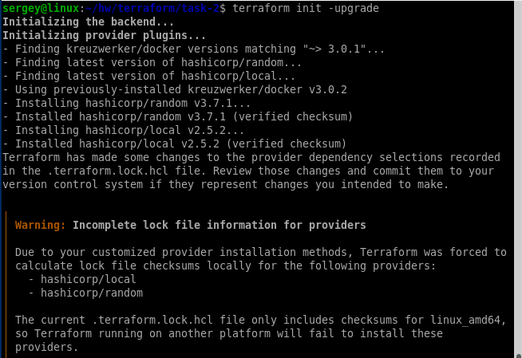

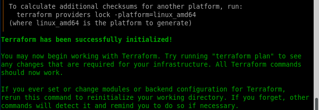

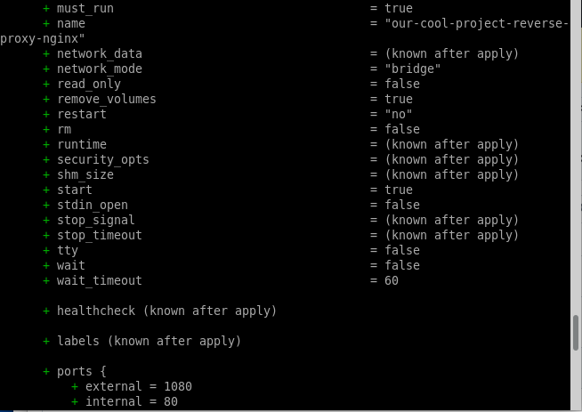

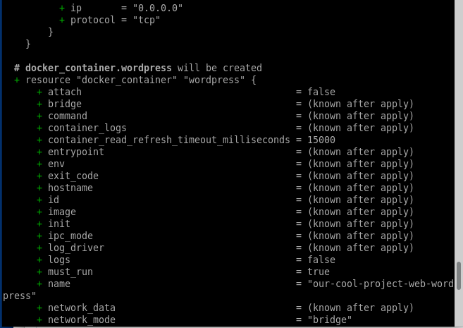

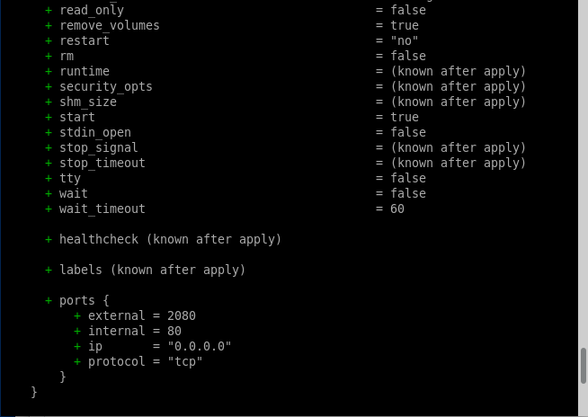

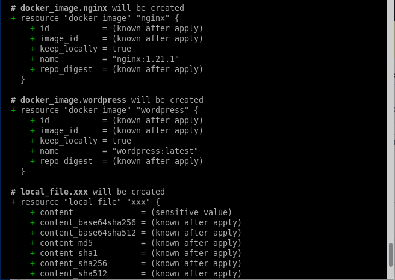

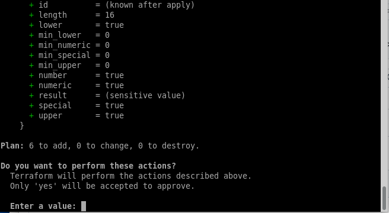

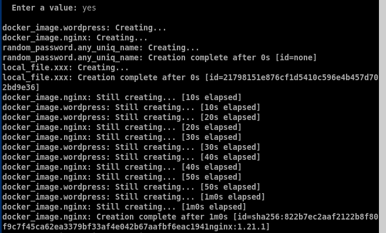

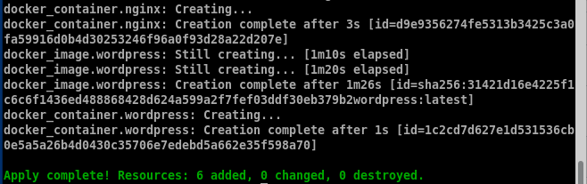

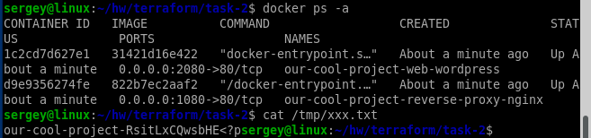

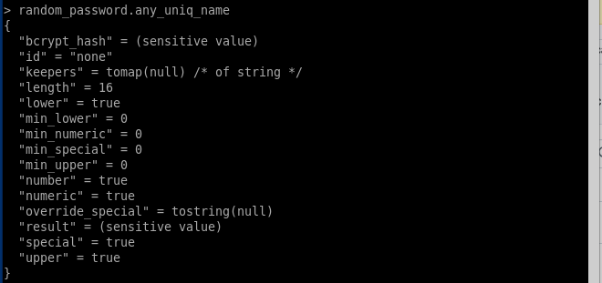

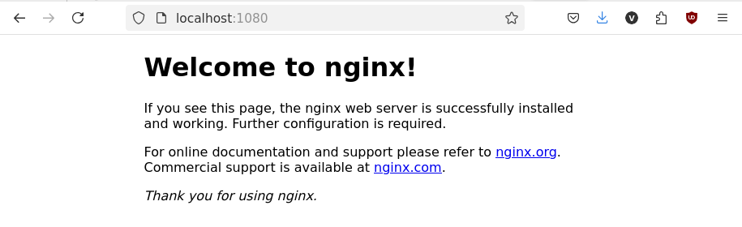

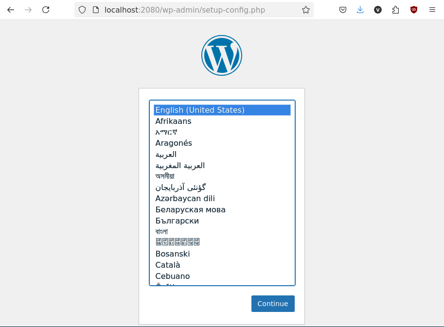

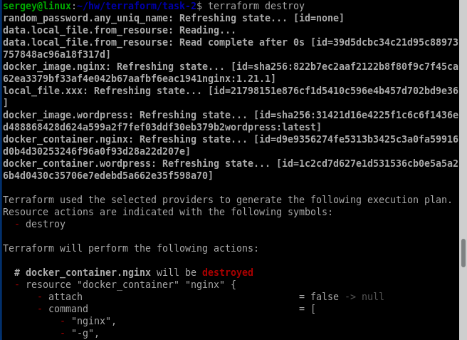

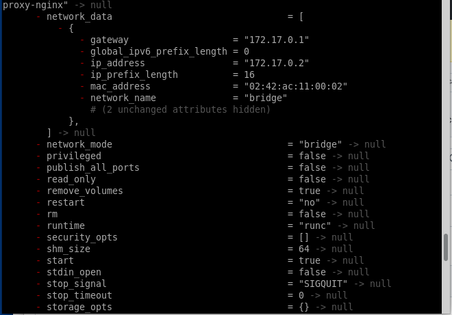

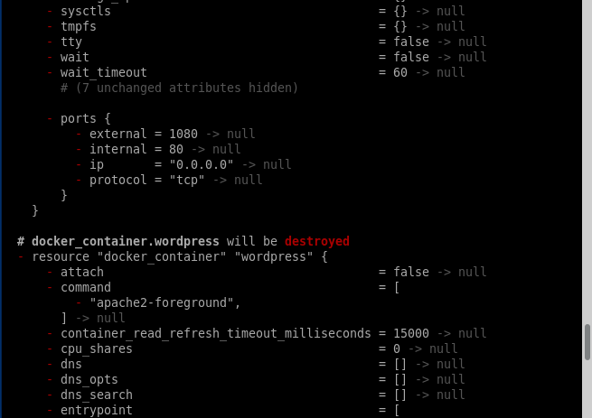

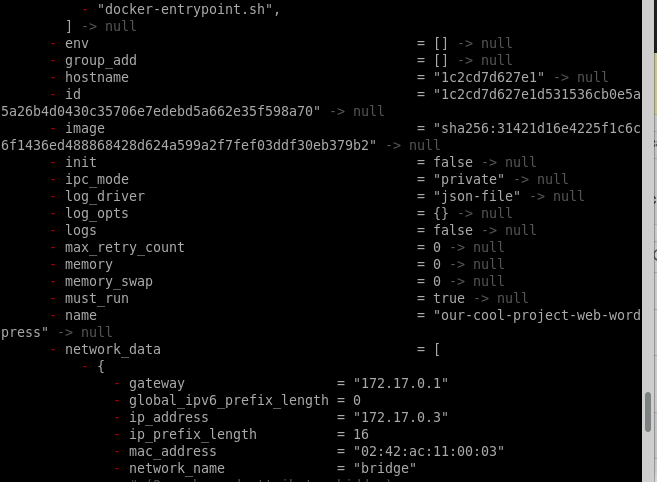

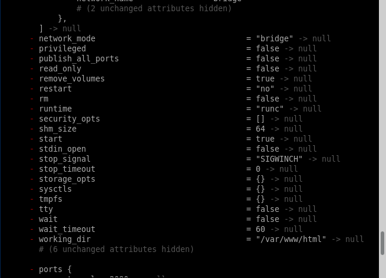

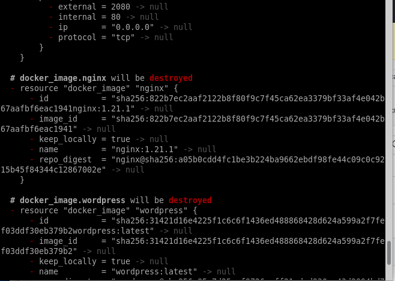

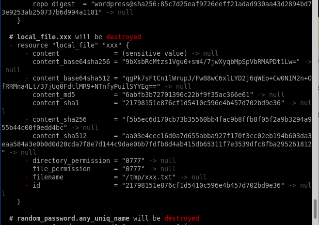

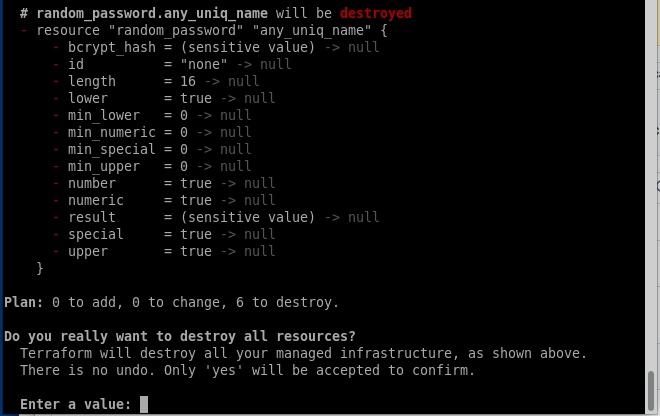

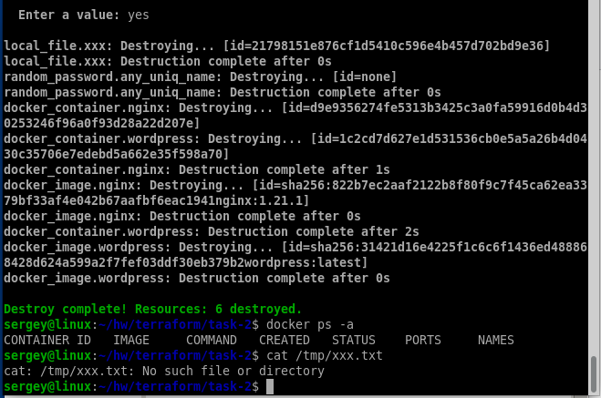

