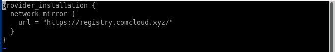
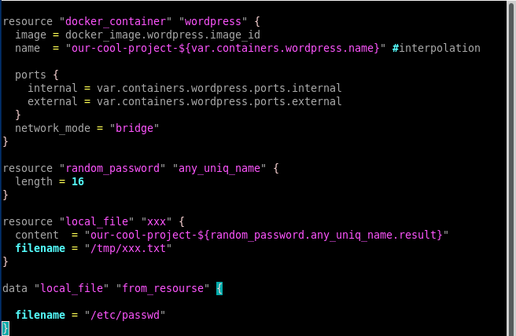
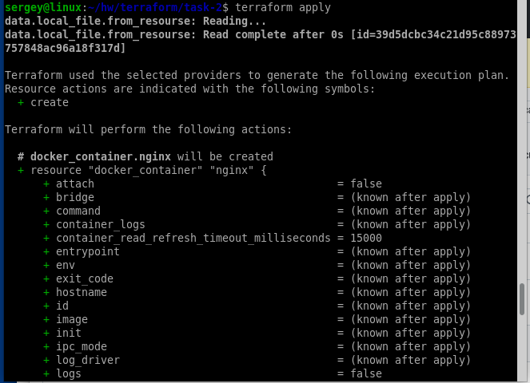
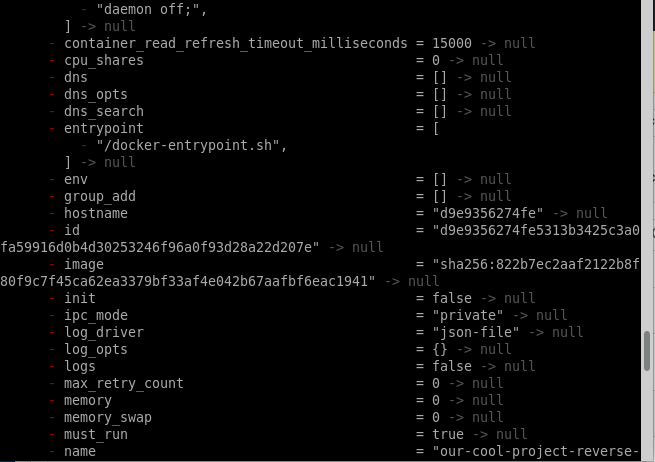

# Домашнее задание к занятию «Terraform». Потапчук Сергей

**Это задание для самостоятельной отработки навыков и не предполагает обратной связи от преподавателя. Его выполнение не влияет на завершение модуля. Но мы рекомендуем не откладывать его выполнение, так как в следующем домашнем задании вы будете использовать Terraform для решения рабочей задачи.**

### Задание

1. Установите Terraform на компьютерную систему (виртуальную или хостовую), используя лекцию или [инструкцию](https://learn.hashicorp.com/tutorials/terraform/install-cli).  download: https://releases.comcloud.xyz/terraform/ 

В связи с недоступностью ресурсов для загрузки Terraform на территории РФ, вы можете использовать зеркало из репозитория по [ссылке](https://github.com/netology-code/devops-materials).

### Решение

Скачал терраформ по ссылке

[https://releases.comcloud.xyz/terraform/1.9.8/terraform_1.9.8_linux_amd64.zip](https://releases.comcloud.xyz/terraform/1.9.8/terraform_1.9.8_linux_amd64.zip)

Распаковал и положил в папку /usr/bin/ и проверил версию.

2. Повторите демо из лекции!

### Решение

Создал файл .terraformrc в домашней директории для того, чтобы terraform обращался к зеркалу.

Создал файл providers.tf и поместил туда блок настройки провайдера

Инициализировал

Проверил текущий каталог, появились скрытые папка .terraform и файл terraform.lock.hcl

Создал файл main.tf в который поместил код для создания ресурсов

и variables.tf в который поместил описание и создание переменных

Проверил запущенные docker контейнеры - пусто

Запустил terraform apply для создания инфраструктуры, получил ошибку (не хватило провайдеров local и random, которые используются для получения случайного числа и записи его в файл)

Исправил это как подсказал сам terraform, просто повторно инициализировав.

Запустил terraform apply еще раз.

Посмотрел какие изменения будут сделаны, и согласился

Прверил запущенные docker контейнеры и созданный файл в папке tmp

Проверил наличие файла terraform.tfstate

В консоли terraform попробовал вывести значение any_uniq_name

Проверил работу Nginx

и Wordpress

Удалил созданную инфраструктуру

Предварительно посмотрев согласился. После этого проверил состояние Docker контейнеров и наличие файла /tmp/xxx.txt

